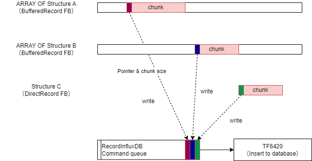
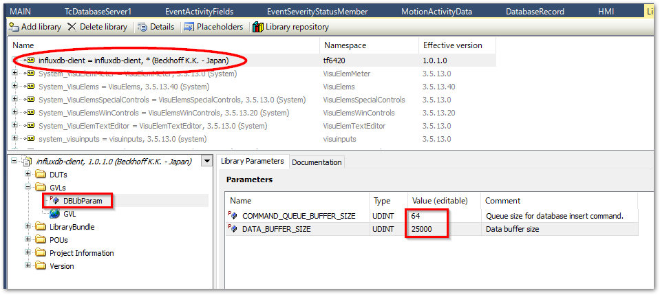

# tc_influxdb_client

This is TwinCAT library that is supporting to record a time series data collected in a PLC tasks to influxDB. This library is based on [sample code on infosys sites](https://infosys.beckhoff.com/content/1033/tf6420_tc3_database_server/8117583755.html?id=5199556541044360835). Plus, it has following features.

* Multi channel support

    Programs on various tasks collect data and record it into a database from these channels through data buffers.

* Asynchronous data processing

    Logging to the data and writing to the database is completely asynchronous.

* The size of data chunk is automatically scaled depends on database writing speed

    High speed cyclic data will be collected on data buffer and send to database with bulk insert. Each data size of bulk insert is adjusted in order to database throughput.



## Requirement

Add library `TC2_Utilities` due to use `T_Arg` types.

## Quick start


1. Define data type to insert to database.

    As [this sites](https://infosys.beckhoff.com/content/1033/tf6420_tc3_database_server/8117583755.html?id=5199556541044360835), `Tag` and `Field` data source structure have to be defined as structure on DUTs.


    Define tag data
    ```{code-block} pascal
    TYPE DataTag:
    STRUCT
        {attribute 'TagName' := 'machine_id'}
        machine_id : STRING;
        {attribute 'TagName' := 'module_name'}
        module_name: STRING;
    END_STRUCT
    END_TYPE
    ```

    Define field data extends tag data
    ```{code-block} pascal
    TYPE MotionActivityData EXTENDS DataTag :
    STRUCT
        {attribute 'FieldName' := 'machine_mode'}
        machime_mode : INT;
        {attribute 'FieldName' := 'activity'}
        activity_id: INT;
        {attribute 'FieldName' := 'position'}
        position : LREAL;
        {attribute 'FieldName' := 'velocity'}
        velocity : LREAL;
        {attribute 'FieldName' := 'acceleration'}
        acceleration : LREAL;
        {attribute 'FieldName' := 'set_position'}
        set_position : LREAL;
        {attribute 'FieldName' := 'set_velocity'}
        set_velocity : LREAL;
        {attribute 'FieldName' := 'set_acceleration'}
        set_acceleration : LREAL;
        {attribute 'FieldName' := 'axis_error_code'}
        axis_error_code : UDINT;
    END_STRUCT
    END_TYPE
    ```

2. Add independent task asigned with independent CPU core shared with windows. 

    The tasks that access database can cause latency. Therefore this task has to be independent from another real-time tasks and CPU cores. However, it is possible to be shared with Windows at approximately 50% load.

3. Add program to connecting database on new task.

    "RecordInfluxDB" function block is database connector driver. The instance of this FB should be created as global variable(e.g. named as GVL.fbRecordInfluxDB). This instance has to be executed everytime cyclically on new task which has been configured previous step of this manual.

    Gloval variable list
    ```{code-block} pascal
    {attribute 'qualified_only'}
    VAR_GLOBAL
        // Database record driver
        fbInfluxDBRecorder	:RecordInfluxDB(DBID := 1);
    END_VAR
    ```

    Program running on independent task and core.
    ```{code-block} pascal
    // Database Writing actions
    GVL.fbInfluxDBRecorder();
    ```

4. Implement data acquisition logic at near from data generated. These can be inplemented in multiple location across tasks.

    Declaring variables of data buffer and Business logic controller FB
    ```{code-block}
    VAR CONSTANT
        DATA_BUFFER_SIZE : UDINT := 25000;
    END_VAR

    VAR
        // Define data buffer that is array of user type structure.
        motion_activity_data_buffer	: ARRAY [0..DATA_BUFFER_SIZE - 1] OF MotionActivityData;
        // Define business logic.
        fbActivityDataController	:BufferedRecord(ADR(motion_activity_data_buffer), HMI.fbInfluxDBRecorder); // data acquision controller.
    END_VAR
    ```

    Program implementation at the data acquisition location. This implementation is needed each of data models.

    ```{code-block}

    // Data acquisition

    motion_activities.machine_id := 'Machine No.1';
    motion_activities.module_name := 'Module A';
    motion_activities.machime_mode := machime_mode;
    motion_activities.position := MAIN.stMover1.NcToPlc.ActPos;
    motion_activities.velocity := MAIN.stMover1.NcToPlc.ActVelo;
        :
        :

    // Property set for insert command    
    fbActivityDataController.db_table_name := 'MeasurementOfMotionData';
    fbActivityDataController.data_def_structure_name := 'MotionActivityData';
    fbActivityDataController.minimal_chunk_size := 100;
    fbActivityDataController.buffer_size := DATA_BUFFER_SIZE;

    // Writing acquired data to queue buffer by write method.
    // Acquired data should be convert to 'F_BIGTYPE' type child of T_Arg generics.
    fbActivityDataController.write(
        input_data := F_BIGTYPE(
            pData := ADR(motion_activities),
            cbLen := SIZEOF(motion_activities)
        )
    );
    ```
5. Adjust buffer size by library parameters.

    This library has following parameters on 'GVLs/DBLibParam'.

    * COMMAND_QUEUE_BUFFER_SIZE

        In most case you can leave the default setting. The command queue is highly loaded in case that there is `BufferedRecord` instance which has very tiny value on `minimum_cunk_size` property despite of concentrated data acquition. This value have to be increased in this case.

    * DATA_BUFFER_SIZE

        It have to be adjust depend on task cycle time and acquired data size.

    

## Details

More details can be referred on [this Japanese document sites](https://beckhoff-jp.github.io/TwinCATHowTo/influxdb/index.html).